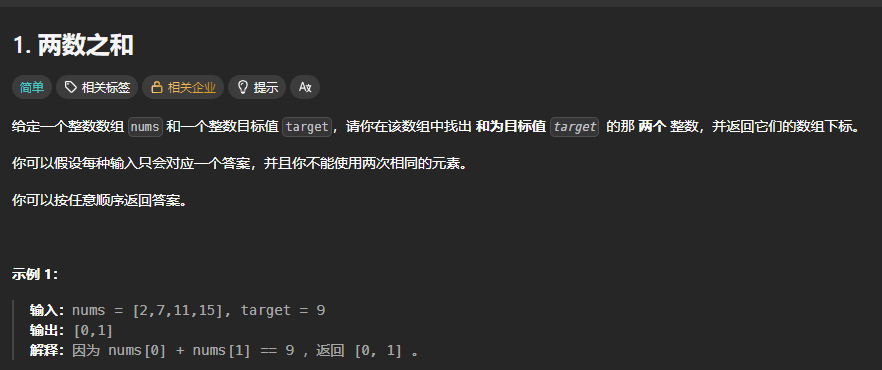
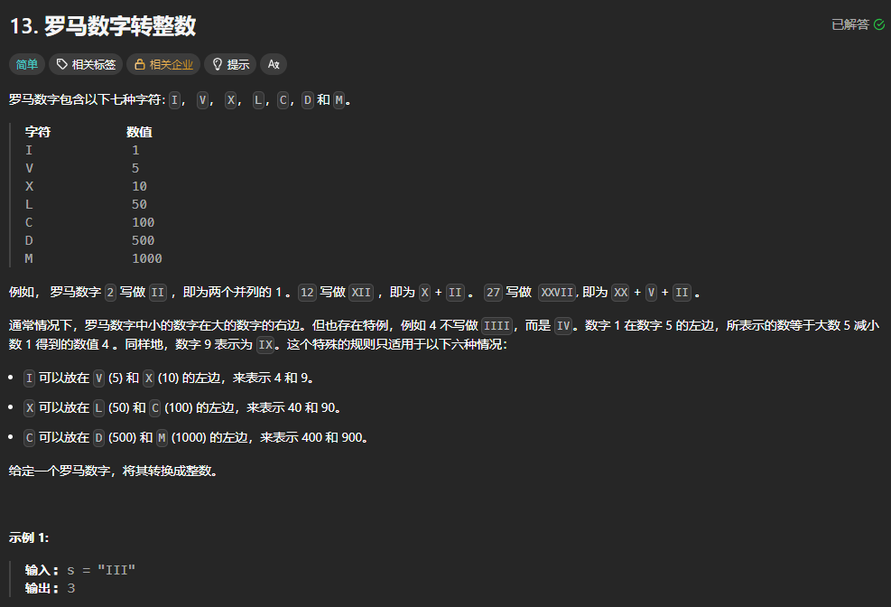
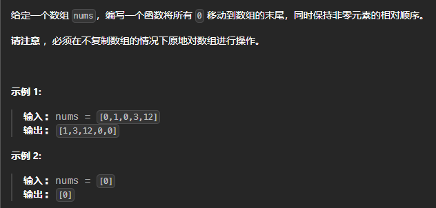

# 一、两数之和
### 题目

### 题解
```js
var twoSum = function (nums, target) {
    for (let i = 0; i < nums.length; i++) {
    for (let j = i + 1; j < nums.length; j++) {
      if (nums[i] + nums[j] === target) {
        return [i, j];
      }
    }
  }
  return [];
};
```

# 二、罗马数字转整数（字符串，数字，哈希表）
### 题目

### 题解
```js
var romanToInt = function (s) {
    const map = {
        'I': 1,
        'V': 5,
        'X': 10,
        'L': 50,
        'C': 100,
        'D': 500,
        'M': 1000
    };

    let total = 0;

    for (let i = 0; i < s.length; i++) {
        const current = map[s[i]];
        const next = map[s[i + 1]];
        if (current < next) {
            total -= current;
        } else {
            total += current;
        }
    }

    return total;
};
```

# 二、 移动零

```js
/**
 * @param {number[]} nums
 * @return {void} Do not return anything, modify nums in-place instead.
 */
var moveZeroes = function (nums) {
    if (!nums.includes(0)) return nums;
    let a = 0;
    for (let i = 0; i < nums.length; i++) {
        if (nums[i] != 0) {
            nums[a] = nums[i];
            a++;
        }
    }
    for (let j = a; j < nums.length; j++) {
        nums[j] = 0;
    }
    return nums;
};
```


