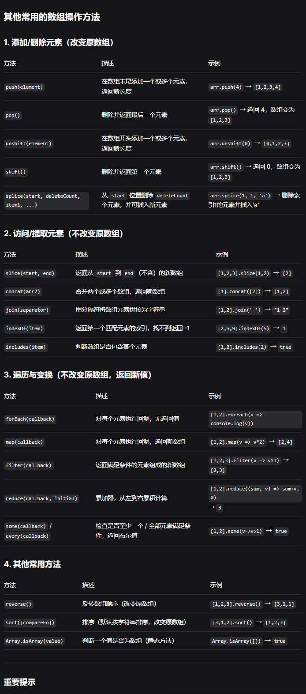

### 1. for...of循环
用于遍历可迭代对象（如字符串、数组、Map、Set 等）的每一个元素。
```js
// 示例
const s = "abc";
for (let ch of s) {
    console.log(ch); 
}
// 输出：a, b, c
```
> 与for...in的区别
> for...in 遍历对象的可枚举属性名（对于字符串，会得到索引 0,1,2...，而不是字符值）。

### 2. 数组常用操作方法
