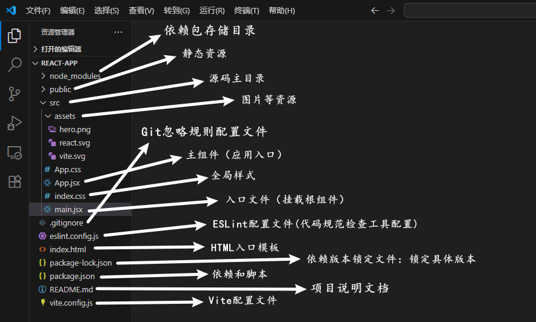

# 创建项目
使用前端构建工具Vite，官方推荐首选 
```bash
#创建指令
npm create vite@latest first-react-app -- --template react
```
- create vite@latest：使用最新版Vite创建工具
- first-react-app：项目名称（推荐写法：小写字母+连字符）
- -- --template react：指定React模板
# 启动项目
```bash
#安装依赖
npm i

# 运行
npm run dev
```
# 项目结构

# 入口文件
```base
import { StrictMode } from 'react'
import { createRoot } from 'react-dom/client'
import './index.css'
import App from './App.jsx'

# ReactDOM.createRoot：React 18 新 API，启用并发特性。
# <App />：渲染你的主组件。
# <React.StrictMode>：开发模式下严格检查，帮助发现问题。

createRoot(document.getElementById('root')).render(
  <StrictMode>
    <App />
  </StrictMode>,
)
```
# 开发React
**1. 工具选择：Visual Studio Code**
- 智能补全
- 插件丰富
- 集成终端
- 调试工具
- 跨平台：Windows，macOS，Linux都完美支持
- 免费开源

**2. 必备插件**
- ESLint：实时检查代码规范
- Prettier - Code formatter：自动格式化代码，保持风格统一
- ES7 + React/Redux/React-Native snippets：输入快捷键快速生成组件
- Path Intellisense：导入路径自动补全（import时）
- GitLens：GIt增强，查看代码提交历史
>安装完成后，重启VS Code

**3. 配置VS Code**
- 在项目根目录创建settings.json（推荐项目级配置）文件，并添加以下内容
```base
{
  # 保存时自动格式化
  "editor.formatOnSave": true,
  # 默认使用 Prettier 格式化
  "editor.defaultFormatter": "esbenp.prettier-vscode",

  # ESLint 自动修复
  "editor.codeActionsOnSave": {
    "source.fixAll.eslint": "explicit"
  },

  # JSX/TSX 文件也应用 Prettier
  "[javascript]": {
    "editor.defaultFormatter": "esbenp.prettier-vscode"
  },
  "[javascriptreact]": {
    "editor.defaultFormatter": "esbenp.prettier-vscode"
  },

  # 显示行号、缩进指南
  "editor.rulers": [80],
  "editor.guides.indentation": true
}
```
>保存后生效。现在每次保存代码，Prettier 会自动格式化，ESLint 会自动修复常见问题。

**4. 常用快捷键**
- Ctrl + S：保存
- Ctrl + /：注释行
- Alt + ↑/↓：移动行
- Ctrl + D：多光标选中相同词
- Ctrl + Shift + P：命令面板（万能）