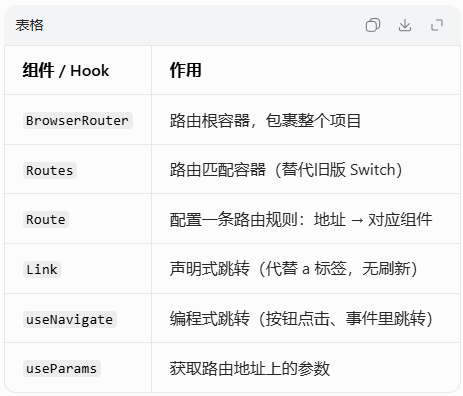

# 1. 什么是路由
- 通俗理解
>正常网页跳转（a 标签）：跳一次刷新一次页面
>React 路由：不刷新整个浏览器页面，只切换页面里的组件，实现单页应用 SPA。

- 作用
> 1. 实现页面跳转：首页 / 列表 / 详情 / 我的
> 2. 地址栏变了，但网页不刷新
> 3. 根据 URL 地址，自动渲染对应组件

# 2. 路由核心API


# 3. 使用路由步骤
## 第一步：安装路由
```bash
npm install react-router-dom
```

## 第二步：全局配置路由
> 在 index.js 入口文件，用 BrowserRouter 把整个 App 包起来：
```jsx
import React from 'react';
import ReactDOM from 'react-dom/client';
import App from './App';
// 引入路由容器
import { BrowserRouter } from 'react-router-dom';

const root = ReactDOM.createRoot(document.getElementById('root'));
root.render(
  {/* 全局包裹路由 */}
  <BrowserRouter>
    <App />
  </BrowserRouter>
);
```
### 基础路由配置 + 页面跳转
> 页面组件：Home.js、List.js、Mine.js
```jsx
import { Routes, Route, Link } from 'react-router-dom';
import Home from './Home';
import List from './List';
import Mine from './Mine';

export default function App() {
  return (
    <div>
      {/* 导航栏：Link 无刷新跳转 代替 a 标签 */}
      <div style={{ margin: '10px 0' }}>
        <Link to="/" style={{ marginRight: '20px' }}>首页</Link>
        <Link to="/list" style={{ marginRight: '20px' }}>列表</Link>
        <Link to="/mine">我的</Link>
      </div>

      {/* 路由规则：地址匹配哪个，就渲染哪个组件 */}
      <Routes>
        <Route path="/" element={<Home />} />
        <Route path="/list" element={<List />} />
        <Route path="/mine" element={<Mine />} />
      </Routes>
    </div>
  );
}
```
> 注意：
> to="/xxx" 对应 path="/xxx"
> Link 跳转不会刷新页面
> Routes 自动精确匹配，不用再加模糊匹配

### 编程式跳转（按钮点击跳转）
> 场景：点击按钮、登录成功后、请求完接口再跳转，不用 Link，用 useNavigate
```jsx
import { useNavigate } from 'react-router-dom';

export default function Login() {
  // 拿到跳转方法
  const navigate = useNavigate();

  const goHome = () => {
    // 跳转到首页
    navigate('/');
  };

  const goBack = () => {
    // 后退上一页
    navigate(-1);
  };

  return (
    <div>
      <h3>登录页</h3>
      <button onClick={goHome}>去首页</button>
      <button onClick={goBack}>返回上一页</button>
    </div>
  );
}
```

### 路由传参 + 接收参数
- 配置动态路由
```jsx
<Route path="/detail/:id" element={<Detail />} />
```

-  跳转传参
```jsx
// Link 传参
<Link to="/detail/1001">商品1001</Link>

// 编程式传参
navigate('/detail/1002');
```

- 页面接收参数 useParams
```jsx
import { useParams } from 'react-router-dom';

export default function Detail() {
  // 获取地址上的 id
  const { id } = useParams();
  return <h3>商品ID：{id}</h3>;
}
```