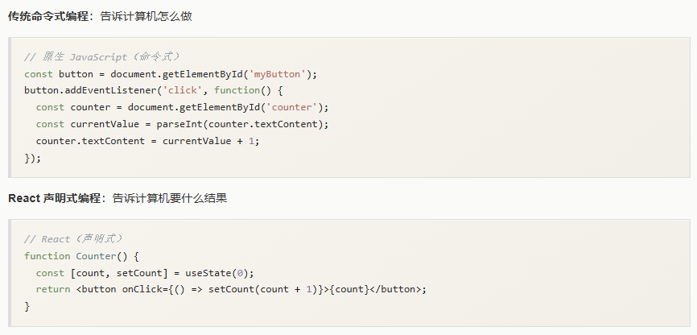
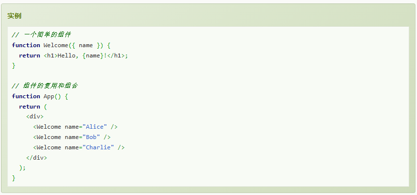
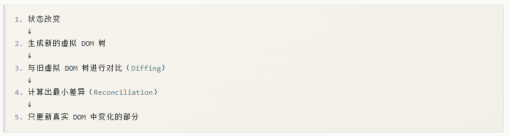
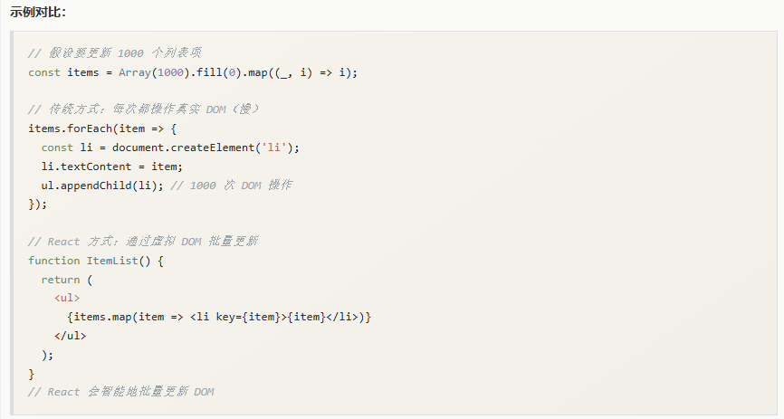
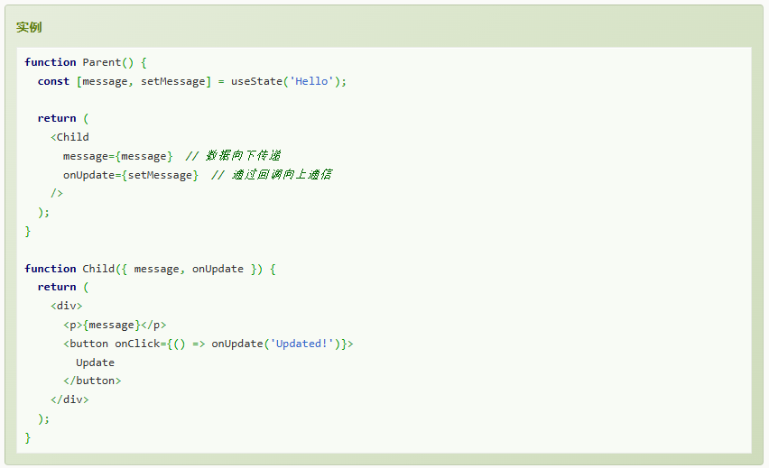

# 1. React 是什么
- React是构建用户界面的JavaScript库，主要用于构建UI。React起源于Facebook（现Meta）的内部项目，由于其拥有较高的性能且代码逻辑简单，故越来越多人开始关注并使用它。
# 2. React 定位
- 不是框架，而是库
- 组件化思想
- JavaScript为中心
# 3. React 特点
- **声明式编程**：相较于传统命令式编程，减少手动操作DOM的错误，代码更简洁直观，更易理解和维护。

- **组件化**：React的核心是组件化思维，把 UI 拆成独立、可复用、可组合的组件。每个组件只关心自己的状态和属性，逻辑清晰、易于维护。

- **虚拟DOM**：虚拟 DOM 是真实 DOM 的 JavaScript 对象表示，是一个轻量级的内存中的数据结构。相较于真实DOM操作，前者减少真实DOM操作次数，性能更优。虚拟DOM可以渲染到不同平台（Web，移动端，桌面）。开发者只需关注状态，不需要手动操作DOM。后者DOM操作较慢。且频繁的操作DOM会导致页面重排和重绘，容易出错。

- **单向数据流**：数据从父组件流向子组件，子组件通过回调函数向父组件通信。

# 4. React 优势
- 学习曲线平缓：核心API较少，主要使用js知识。
- 强大生态系统：路由（React Router），状态管理（Redux，Zustand，jotai）,UI库（Material-UI，Ant Design，Chakra UI），工具链（Create React App，Vite，Next.js）
- 广泛社区支持：最受欢迎前端库之一，大量第三方组件和工具，活跃社区和丰富学习资源。
- 性能优异：虚拟DOM优化，按需渲染，代码分割和懒加载支持。
- 跨平台能力：React Native开发移动应用，React Native for Windows开发桌面应用，React 360开发VR应用。
- 企业级应用支持：被众多知名大企业使用
# 5. React 使用场景
**1. 适用场景**
- 单页应用（SPA）
- 需要频繁更新的动态页面
- 复杂的交互式UI
- 需要组件复用的大型项目
- 需要跨平台开发的应用
**2. 不适用场景**
- 简单的静态网站（过度设计）
- SEO要求极高的网站（需配合Next.js等SSR方案）