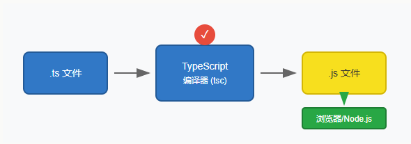

# 一、TypeScript 简介
TypeScript 是由 Microsoft 开发的开源编程语言，它是 JavaScript 的超集。（在 JavaScript 的基础上增加了**静态类型检查**的超集）

# 二、TypeScript 优势
- 静态类型检查：在编译时发现类型错误，减少运行时错误
- 强大的 IDE 支持：智能代码补全、导航和重构
- 更好的代码可读性：类型本身就是最好的文档
- 现代 JavaScript 特性：支持 ES6+ 语法，如箭头函数、模块、类等
- 渐进式迁移：可以逐步将现有 JavaScript 项目迁移到 TypeScript

# 三、TypeScript 工作原理
TypeScript 不能直接在浏览器中运行，它需要先编译为 JavaScript。这个编译过程会检查类型错误，并将 TypeScript 特有的语法转换为纯 JavaScript。

TypeScript 编译器 (tsc) 在编译过程中进行类型检查，如果发现类型错误会报错并阻止编译。编译成功后生成纯 JavaScript 代码，可以在任何浏览器或 Node.js 环境中运行。

# 四、TypeScript 安装
1. 安装typescript指令
```bash
npm install -g typescript
```

2. 新建xxx.ts文件（使用 .ts 作为 TypeScript 代码文件的扩展名）
```ts
var message:string = "Hello World" 
console.log(message)
```

3. 将ts转换为js
```bash
tsc app.ts
```
这时候在当前目录下（与 app.ts 同一目录）就会生成一个 app.js 文件
```js
var message = "Hello World";
console.log(message);
```

4. node 命令来执行 xxx.js 文件
```bash
$ node app.js 
Hello World
```


