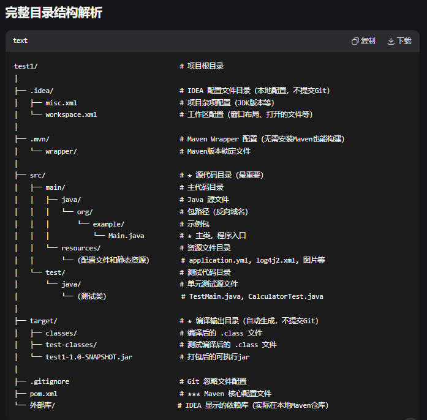

# 一、环境搭建与HelloWorld
### 1. IDEA安装
百度搜索Idea2025破解版，跟着教程来

### 2. jdk选择
> jdk是java开发工具包，包含java编程所需要的工具和运行环境。
新建一个Maven构建系统（典型企业选配），选择jdk1.8（java8）

### 3. 目录结构

> 目录被 IDEA 标记为源码目录 = 多出 Java 新建项；普通目录 = 只有通用文件新建。

### 4. HelloWorld
在src目录下新建一个普通目录，然后再新建一个目录并将其标记为源码目录，随后在该目录下新建java文件，最后再sout-HelloWorld。

# 二、变量 + 8 大基本数据类型 + 运算符
### 1. 变量
> 存数据的容器
命名规则：字母、数字、_、$。不能数字开头。小驼峰。不能用关键字
格式：数据类型 变量名 = 值;
常量：final 不可更改
```java
final double PI = 3.14;
// PI = 3.15; 报错，常量不可改
```

### 2. 八大基本数据类型
1. 整形
- byte 
- short
- int（常用）
- long

2. 浮点
- float
- double（常用）

3. 字符（只能一个字）
- char
```
char c = 'A'
```

4. 布尔
- boolean

### 3. 引用类型
- String
```
String name = “小李”
```

### 4. 运算符
1. 算数：+、-、*、/、%

2. 自增++/自减--

3. 关系（结果为布尔）：>、<、>=、<=、==、!=

4. 三元：条件 ? 成立值 : 不成立值

### 5.  Scanner 类实现输入
```java
import java.util.Scanner;  // 1. 导入Scanner类

public class InputDemo {
    public static void main(String[] args) {
        // 2. 创建Scanner对象
        Scanner scanner = new Scanner(System.in);
        
        // 3. 读取不同类型的数据
        System.out.println("请输入字符串: ");
        String str = scanner.next();        // 读取字符串（遇到空格结束）
        
        System.out.print("请输入一行文字: ");
        String line = scanner.nextLine();   // 读取整行（包含空格）
        
        System.out.print("请输入整数: ");
        int num = scanner.nextInt();        // 读取整数
        
        System.out.print("请输入小数: ");
        double d = scanner.nextDouble();    // 读取小数
        
        System.out.print("请输入布尔值: ");
        boolean b = scanner.nextBoolean();  // 读取布尔值
        
        // 4. 关闭scanner（释放资源）
        scanner.close();
        
        // 输出结果
        System.out.println("字符串: " + str);
        System.out.println("整行: " + line);
        System.out.println("整数: " + num);
        System.out.println("小数: " + d);
        System.out.println("布尔值: " + b);
    }
}
```

# 三、分支+循环+数组
1. if 系列
- 单分支 if
- 双分支 if-else
- 多分支 else if

2. switch
```java
int num = 2;
switch (num) {
    case 1:
        System.out.println("星期一");
        break; // 必须写break，否则会穿透执行
    case 2:
        System.out.println("星期二");
        break;
    default:
        System.out.println("输入错误");
}
```

3. for 

4. while
> 先判断条件，再执行

5. 循环控制关键字
- break：直接结束整个循环
- continue：跳过本次循环，继续下一次

6. 数组
定义：
```
// 方式1：直接赋值（最常用）
int[] scores = {90, 85, 95, 80};

// 方式2：指定长度，后赋值
int[] nums = new int[4]; // 长度为4的数组
nums[0] = 10; // 给第1个位置赋值
```

# 四、面向对象核心 —— 类、对象、构造方法、this 关键字
1. 类
一个标准的类，包含两部分：
- 成员变量（属性
- 成员方法（行为）
```
// 类：人类（模板）
public class Person {
    // 成员变量（属性）
    String name; // 姓名
    int age;     // 年龄

    // 成员方法（行为）
    public void sayHello() {
        System.out.println("大家好，我是" + name + "，今年" + age + "岁！");
    }
}
```

2. 对象
有了类（模板），我们就可以创建对象（具体的人）了
```
// 测试类：程序入口（必须有main方法）
public class TestPerson {
    public static void main(String[] args) {
        // 1. 创建对象：根据Person类，创建一个具体的人（对象）
        Person p1 = new Person();

        // 2. 给对象的属性赋值
        p1.name = "张三";
        p1.age = 20;

        // 3. 调用对象的方法
        p1.sayHello(); // 输出：大家好，我是张三，今年20岁！

        // 再创建一个对象
        Person p2 = new Person();
        p2.name = "李四";
        p2.age = 22;
        p2.sayHello();
    }
}
```

3. 构造方法
定义：创建对象时，自动执行的方法，专门用来给对象赋值
特点：
- 方法名 必须和类名完全一样
- 没有返回值（连void都不用写）
- 创建对象new 类名()时，自动调用

两种构造方法：
- 无参构造（默认自带）：不写也会自动存在，创建空对象

```
// 无参构造
public Person() {
    System.out.println("无参构造执行了！");
}
```

- 有参构造（自定义，最常用）：创建对象时直接赋值

```
// 有参构造：接收姓名和年龄
public Person(String name, int age) {
    // 给成员变量赋值
    this.name = name;
    this.age = age;
}
```

4. this关键字
为何用This：当局部变量（方法参数）和成员变量重名时，Java 分不清，需要用this区分。

```
public class Person {
    String name; // 成员变量

    // 参数 name 是局部变量
    public Person(String name) {
        // this.name = 成员变量；name = 局部变量
        this.name = name;
    }
}
```

5. 注意
- 类名必须大驼峰（Person、Student），变量小驼峰
- 成员变量写在类里面、方法外面
- 构造方法没有返回值，千万不要写void
- this. 用来区分成员变量和局部变量，重名必加


# 五、面向对象核心特性 → 封装 + 继承
1. 封装
为什么要封装？
数据完全错误，但代码不报错，这就是数据不安全。（如int age 给其赋值 -10）

封装的作用：
把类的属性私有化，禁止外部直接修改，只能通过我规定的方法访问 / 修改，还能加数据校验。

封装步骤：
- 属性私有化：用 private 修饰成员变量（外部无法直接访问）
- 提供公共 get 方法：获取属性值（getXxx()）
- 提供公共 set 方法：修改属性值（setXxx()）

```
public class Person {
    // 1. 私有化属性（核心！）
    private String name;
    private int age;

    // 2. 提供set方法：给属性赋值（可加校验）
    public void setName(String name) {
        this.name = name;
    }
    public void setAge(int age) {
        // 数据校验：年龄不能为负数，不能超过150
        if(age < 0 || age > 150){
            System.out.println("年龄输入错误！");
            this.age = 0; // 默认值
            return;
        }
        this.age = age;
    }

    // 3. 提供get方法：获取属性值
    public String getName() {
        return name;
    }
    public int getAge() {
        return age;
    }

    // 成员方法
    public void sayHello(){
        System.out.println("我是"+name+"，今年"+age+"岁");
    }
}
```

```
public class TestPerson {
    public static void main(String[] args) {
        Person p = new Person();
        
        // 错误：不能直接访问 private 属性
        // p.name = "张三"; ❌ 报错
        
        // 正确：通过 set 方法赋值
        p.setName("张三");
        p.setAge(20); 
        
        // 通过 get 方法获取值
        System.out.println(p.getName()); 
        p.sayHello();

        // 测试校验：赋值负数，自动拦截
        p.setAge(-5); 
    }
}
```

> IDEA 神器：不用手写 get/set！：右键 → Generate → Getter and Setter → 一键生成！

2. 继承
为什么要继承？
如果我们要写 Student（学生）、Teacher（老师）类，他们都有 name、age 属性，都有 sayHello 方法。如果每个类都写一遍，代码大量重复！

继承作用：
子类（学生 / 老师）继承父类（人），直接使用父类的属性和方法，不用重复编写。

继承语法：
- 关键字：extends
- 格式：子类 extends 父类
- 规则：Java 只支持单继承（一个子类只能有一个父类）

3. super关键字
this：调用当前对象的属性 / 方法
super：调用父类的属性 / 方法

```java
public Student(String name, int age){
    super(name, age); // 调用父类的有参构造
}
```

3. 方法重写（Override）
子类觉得父类的方法不好用，可以重写一个属于自己的版本。
- 方法名、参数、返回值 必须和父类完全一样
- 标注 @Override（校验是否重写正确）

```
class Student extends Person {
    // 重写父类的 sayHello 方法
    @Override
    public void sayHello(){
        System.out.println("我是学生"+getName()+"，很高兴认识大家！");
    }
}
```


