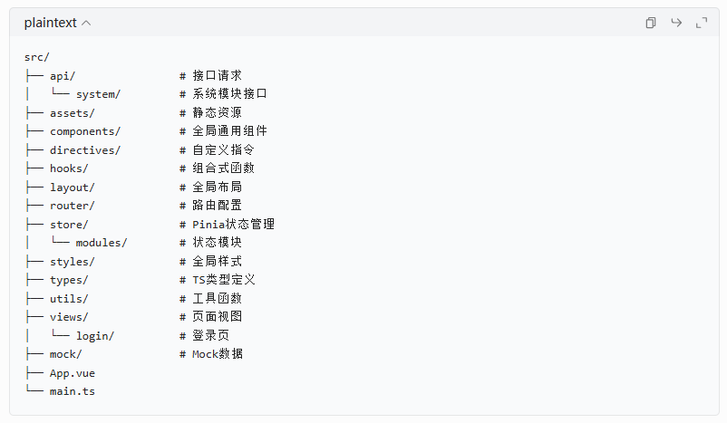

# 第一阶段
# 一. 基础架构搭建
1. 使用vite快速创建Vue3+TypeScript项目结构
```bash
//指令
npm create vite@latest
```

2. 测试运行
使用指令”npm run dev“测试运行 --> 程序运行正常

3. 安装依赖
```bash
// 核心业务依赖
npm install vue-router pinia axios element-plus

// 开发依赖
npm i -D less eslint-plugin-vue @types/node
```
> -D： 表示devDependencies，只在开发环境使用
> less： CSS预处理器，支持嵌套变量、混合、函数等特性，让CSS编写更高效
> less-loader： Webpack的loader，用于将.less文件编译成可识别的CSS。Vite不许单独安装，其内置了对Less的支持。
> @types/node： Node.js 的 TypeScript 类型定义文件，让 TypeScript 能识别 fs、path、process 等 Node.js 核心模块

4. 配置代码规范与提交规范

（1）**配置 ESLint + Prettier**

项目根目录创建 / 修改以下文件：
.eslintrc.cjs
```js
/* eslint-env node */
require('@rushstack/eslint-patch/modern-module-resolution')

module.exports = {
  root: true,
  extends: [
    'plugin:vue/vue3-essential',
    'eslint:recommended',
    '@vue/eslint-config-typescript',
    '@vue/eslint-config-prettier'
  ],
  parserOptions: {
    ecmaVersion: 'latest'
  },
  rules: {
    // 自定义规则，根据团队习惯调整
    'vue/multi-word-component-names': 'off',
    'no-console': process.env.NODE_ENV === 'production' ? 'warn' : 'off',
    'no-debugger': process.env.NODE_ENV === 'production' ? 'warn' : 'off'
  }
}
```

.prettierrc.cjs
```json
{
  "semi": false,
  "singleQuote": true,
  "tabWidth": 2,
  "trailingComma": "none",
  "printWidth": 100
}
```

.gitignore
```plaintext
# Logs
logs
*.log
npm-debug.log*
yarn-debug.log*
yarn-error.log*
pnpm-debug.log*
lerna-debug.log*

node_modules
dist
dist-ssr
*.local

# Editor directories and files
.vscode/*
!.vscode/extensions.json
.idea
.DS_Store
*.suo
*.ntvs*
*.njsproj
*.sln
*.sw?

# 环境变量文件（包含敏感信息）
.env
.env.local
.env.*.local
```

（2）**关联仓库**
1. 进入项目目录
```bash
cd 项目路径
```
2. 初始化Git
```bash
git init
```
3. 添加仓库地址
```bash
git remote add origin https://github.com/你的用户名/仓库名.git
```
4. 拉取远程仓库内容（避免冲突）
```bash
git pull origin main --allow-unrelated-histories
```
5. 添加并提交本地代码
```bash
git add .
git commit -m "Initial commit"
```
6. 推送到远程
```bash
git push -u origin main
```

（3）**配置Husky+Lint-staged**
```bash
npx husky-init    // 初始化 Husky（Git Hooks 管理工具）
npm install   //  安装 Husky 及相关依赖
npx husky add .husky/pre-commit "npx lint-staged" //添加一个 pre-commit hook 意思是：在每次 git commit 之前，自动执行 npx lint-staged
```
在 package.json 中添加：
```json
{
  "lint-staged": {
    "*.{js,ts,vue}": ["eslint --fix", "prettier --write"]
  },
  "scripts": {
    "lint": "eslint . --ext .vue,.js,.ts --fix"
  }
}
```
> 此后每次提交代码，都会自动检查并修复代码格式，保证整个项目的代码风格统一。

（4）**代码保存自动格式化**

安装好ESLint、Prettier插件后，在项目根目录下创建.vscode文件夹，在该文件夹下面创建settings.json文件，填入下面内容：
```json
{
  // 保存文件时自动格式化
  "editor.formatOnSave": true,
  // 保存时自动修复ESLint错误
  "editor.codeActionsOnSave": {
    "source.fixAll.eslint": true
  },
  // 默认格式化工具：Prettier
  "editor.defaultFormatter": "esbenp.prettier-vscode",
  // Vue/TS/JS 文件关联格式化工具
  "[vue]": {
    "editor.defaultFormatter": "esbenp.prettier-vscode"
  },
  "[typescript]": {
    "editor.defaultFormatter": "esbenp.prettier-vscode"
  },
  "[javascript]": {
    "editor.defaultFormatter": "esbenp.prettier-vscode"
  },
  // 禁用VSCode自带校验，避免冲突
  "typescript.format.enable": false
}
```

# 二、Vite 核心配置
1. 先安装配置所需依赖
```bash
npm install -D unplugin-auto-import unplugin-vue-components
```

2. 配置vite.config.ts文件
```ts
// vite.config.ts 整个项目的构建配置文件
import { defineConfig } from 'vite'
import vue from '@vitejs/plugin-vue'
import AutoImport from 'unplugin-auto-import/vite'
import { ElementPlusResolver } from 'unplugin-vue-components/resolvers'
import Components from 'unplugin-vue-components/vite'
import { resolve } from 'path'

// https://vite.dev/config/
export default defineConfig({
  plugins: [
    vue(),
    // Element Plus自动导入，不用每个页面都import
    AutoImport({
      resolvers: [ElementPlusResolver()],
      imports: ['vue', 'vue-router', 'pinia'],
      dts: 'src/auto-imports.d.ts'
    }),
    Components({
      resolvers: [ElementPlusResolver()],
      dts: 'src/components.d.ts'
    })
  ],
  resolve: {
    //配置路径别名，以后道路文件不用写../../了
    alias: {
      '@': resolve(__dirname, 'src'),
      '@api': resolve(__dirname, 'src/api'),
      '@components': resolve(__dirname, 'src/components'),
      '@hooks': resolve(__dirname, 'src/hooks'),
      '@utils': resolve(__dirname, 'src/utils'),
      '@store': resolve(__dirname, 'src/store')
    }
  },
  server: {
    port: 3000, // 改成3000端口，和后端常用端口区分
    open: true, // 启动后自动打开浏览器
    proxy: {
      // 配置代理，解决跨域问题
      '/api': {
        target: 'http://localhost:8080', //后端接口地址
        changeOrigin: true,
        rewrite: (path) => path.replace(/^\/api/, '')
      }
    }
  },
  build: {
    rollupOptions: {
      output: {
        // 修复：manualChunks 改为【函数写法】（解决TS类型报错）
        manualChunks(id: string) {
          // 打包 Vue 生态依赖
          if (
            id.includes('node_modules/vue') ||
            id.includes('node_modules/vue-router') ||
            id.includes('node_modules/pinia')
          ) {
            return 'vue'
          }
          // 打包 Element Plus
          if (id.includes('node_modules/element-plus')) {
            return 'elementPlus'
          }
        }
      }
    }
  }
})
```

# 三、创建标准项目目录结构
删除 src 目录下默认的 components/HelloWorld.vue、assets/vue.svg、App.vue 里的内容，然后创建以下目录结构：


# 四、核心基础能力封装（按顺序做）
### 1. 封装 Axios 请求（最核心，所有接口都要用）
创建 src/utils/request.ts：
```
import axios from 'axios'
import { useUserStore } from '@store/modules/user'
import { ElMessage, ElMessageBox } from 'element-plus'
// 创建axios实例
const service = axios.create({
  baseURL: import.meta.env.VITE_APP_BASE_API, //从环境变量获取接口地址
  timeout: 15000 //请求超时时间
})

//请求拦截器
service.interceptors.request.use(
  (config) => {
    const userStore = useUserStore()
    //自动添加token
    if (userStore.token) {
      config.headers.Authorization = `Bearer ${userStore.token}`
    }
    return config
  },
  (error) => {
    console.log(error)
    return Promise.reject(error)
  }
)

//响应拦截器
service.interceptors.response.use(
  (response) => {
    const res = response.data
    //这里的code要和后端约定好，比如200表示成功
    if (res.code !== 200) {
      ElMessage({
        message: res.message || '请求失败',
        type: 'error',
        duration: 5 * 1000
      })
    }

    //401:token过期或未登录
    if (res.code === 401) {
      ElMessageBox.confirm('登录已过期，请重新登录', '提示', {
        confirmButtonText: '重新登录',
        cancelButtonText: '取消',
        type: 'warning'
      }).then(() => {
        const userStore = useUserStore()
        userStore.resetToken()
        location.reload()
      })
      return Promise.reject(new Error(res.message || '请求失败'))
    } else {
      return res
    }
  },
  (error) => {
    console.log('err' + error)
    ElMessage({
      message: error.message,
      type: 'error',
      duration: 5 * 1000
    })
    return Promise.reject(error)
  }
)

export default service
```

### 2. 配置环境变量
在项目根目录创建 3 个环境变量文件：
.env.development（开发环境）
```plaintext
# 页面标题
VITE_APP_TITLE = Vue3 Admin Pro

# 接口地址
VITE_APP_BASE_API = /api
```

.env.production（生产环境）
```plaintext
VITE_APP_TITLE = Vue3 Admin Pro
VITE_APP_BASE_API = shturl.cc/GGUOqhdaLn8uorMYZ
```

.env（通用环境变量）
```plaintext
NODE_ENV = production
```

### 3. 配置 Pinia 状态管理
创建 src/store/index.ts：
```ts
import { createPinia } from 'pinia'

const pinia = createPinia()

export default pinia
```

创建第一个状态模块 src/store/modules/user.ts：
```ts
import { defineStore } from 'pinia'
import { login, logout, getUserInfo } from '@/api/system/user'
import { getToken, setToken, removeToken } from '@/utils/auth'

interface UserState {
  token: string
  name: string
  avatar: string
  roles: string[]
  permissions: string[]
}

export const useUserStore = defineStore('user', {
  state: (): UserState => ({
    token: getToken() || '',
    name: '',
    avatar: '',
    roles: [],
    permissions: []
  }),

  actions: {
    // 登录
    async login(userInfo: { username: string; password: string }) {
      const { username, password } = userInfo
      const res = await login({ username: username.trim(), password })
      this.token = res.data.token
      setToken(res.data.token)
    },

    // 获取用户信息
    async getUserInfo() {
      const res = await getUserInfo()
      this.name = res.data.name
      this.avatar = res.data.avatar
      this.roles = res.data.roles
      this.permissions = res.data.permissions
      return res.data
    },

    // 退出登录
    async logout() {
      await logout()
      this.token = ''
      this.roles = []
      this.permissions = []
      removeToken()
    },

    // 重置token
    resetToken() {
      this.token = ''
      this.roles = []
      this.permissions = []
      removeToken()
    }
  }
})
```

创建 src/utils/auth.ts（token 工具）：
```ts
const TokenKey = 'Admin-Token'

export function getToken() {
  return localStorage.getItem(TokenKey)
}

export function setToken(token: string) {
  return localStorage.setItem(TokenKey, token)
}

export function removeToken() {
  return localStorage.removeItem(TokenKey)
}
```

### 4. 配置 Vue Router
创建 src/router/index.ts：
```ts
import { createRouter, createWebHistory } from 'vue-router'
import { useUserStore } from '@/store/modules/user'
import { usePermissionStore } from '@/store/modules/permission'

// 静态路由：所有人都能访问
export const constantRoutes = [
  {
    path: '/login',
    component: () => import('@/views/login/index.vue'),
    meta: { hidden: true }
  },
  {
    path: '/404',
    component: () => import('@/views/error/404.vue'),
    meta: { hidden: true }
  },
  {
    path: '/',
    component: () => import('@/layout/index.vue'),
    redirect: '/dashboard',
    children: [
      {
        path: 'dashboard',
        name: 'Dashboard',
        component: () => import('@/views/dashboard/index.vue'),
        meta: { title: '仪表盘', icon: 'dashboard' }
      }
    ]
  }
]

// 动态路由：需要权限才能访问
export const asyncRoutes = []

const router = createRouter({
  history: createWebHistory(import.meta.env.BASE_URL),
  routes: constantRoutes
})

// 路由守卫
router.beforeEach(async (to, from, next) => {
  const userStore = useUserStore()
  const permissionStore = usePermissionStore()

  // 有token
  if (userStore.token) {
    if (to.path === '/login') {
      next('/')
    } else {
      // 判断是否已经获取了用户信息
      if (userStore.roles.length === 0) {
        try {
          // 获取用户信息
          await userStore.getUserInfo()
          // 根据用户权限生成可访问的路由
          const accessRoutes = await permissionStore.generateRoutes(userStore.roles)
          // 动态添加路由
          accessRoutes.forEach((route) => {
            router.addRoute(route)
          })
          next({ ...to, replace: true })
        } catch (error) {
          // 获取用户信息失败，重置token并跳转到登录页
          await userStore.resetToken()
          ElMessage.error('获取用户信息失败，请重新登录')
          next(`/login?redirect=${to.path}`)
        }
      } else {
        next()
      }
    }
  } else {
    // 没有token
    if (['/login'].includes(to.path)) {
      next()
    } else {
      next(`/login?redirect=${to.path}`)
    }
  }
})

export default router
```

### 完善 main.ts
修改 src/main.ts：
```ts

import { createApp } from 'vue'
import App from './App.vue'
import router from './router'
import pinia from './store'
import ElementPlus from 'element-plus'
import 'element-plus/dist/index.css'
import * as ElementPlusIconsVue from '@element-plus/icons-vue'
import './styles/index.css'

const app = createApp(App)

// 全局注册Element Plus图标
for (const [key, component] of Object.entries(ElementPlusIconsVue)) {
  app.component(key, component)
}

app.use(pinia)
app.use(router)
app.use(ElementPlus)

app.mount('#app')
```

# 五、第一个页面与布局开发
1. 创建全局 Layout 布局
创建 src/layout/index.vue，这是中后台的基础框架，包含侧边栏、顶部导航和主内容区：
```vue
<template>
  <div class="app-wrapper">
    <el-container class="app-container">
      <!-- 侧边栏 -->
      <el-aside width="220px" class="sidebar">
        <div class="logo-container">
          <h2 class="logo-title">{{ title }}</h2>
        </div>
        <el-menu
          :default-active="$route.path"
          router
          mode="vertical"
          class="sidebar-menu"
        >
          <template v-for="item in menuList" :key="item.path">
            <el-menu-item v-if="!item.children" :index="item.path">
              <el-icon><component :is="item.meta.icon" /></el-icon>
              <span>{{ item.meta.title }}</span>
            </el-menu-item>
            <el-sub-menu v-else :index="item.path">
              <template #title>
                <el-icon><component :is="item.meta.icon" /></el-icon>
                <span>{{ item.meta.title }}</span>
              </template>
              <el-menu-item
                v-for="child in item.children"
                :key="child.path"
                :index="child.path"
              >
                {{ child.meta.title }}
              </el-menu-item>
            </el-sub-menu>
          </template>
        </el-menu>
      </el-aside>

      <!-- 主内容区 -->
      <el-container>
        <!-- 顶部导航 -->
        <el-header class="header">
          <div class="header-left">
            <el-button
              type="text"
              icon="Expand"
              @click="toggleSidebar"
            />
          </div>
          <div class="header-right">
            <el-dropdown @command="handleCommand">
              <span class="user-info">
                <el-avatar :src="userStore.avatar" />
                {{ userStore.name }}
              </span>
              <template #dropdown>
                <el-dropdown-menu>
                  <el-dropdown-item command="profile">个人中心</el-dropdown-item>
                  <el-dropdown-item command="logout">退出登录</el-dropdown-item>
                </el-dropdown-menu>
              </template>
            </el-dropdown>
          </div>
        </el-header>

        <!-- 页面内容 -->
        <el-main class="main-content">
          <router-view />
        </el-main>
      </el-container>
    </el-container>
  </div>
</template>

<script setup lang="ts">
import { useUserStore } from '@/store/modules/user'
import { usePermissionStore } from '@/store/modules/permission'

const userStore = useUserStore()
const permissionStore = usePermissionStore()

const title = import.meta.env.VITE_APP_TITLE
const menuList = computed(() => permissionStore.routes)

const toggleSidebar = () => {
  // 后续实现侧边栏折叠功能
}

const handleCommand = (command: string) => {
  if (command === 'logout') {
    ElMessageBox.confirm('确定要退出登录吗？', '提示', {
      confirmButtonText: '确定',
      cancelButtonText: '取消',
      type: 'warning'
    }).then(async () => {
      await userStore.logout()
      router.push('/login')
    })
  }
}
</script>

<style scoped>
.app-wrapper {
  height: 100vh;
  width: 100%;
}

.app-container {
  height: 100%;
}

.sidebar {
  background-color: #304156;
  transition: width 0.3s;
}

.logo-container {
  height: 60px;
  display: flex;
  align-items: center;
  justify-content: center;
  background-color: #2b2f3a;
}

.logo-title {
  color: #fff;
  font-size: 18px;
  font-weight: 600;
}

.sidebar-menu {
  border-right: none;
}

.header {
  background-color: #fff;
  box-shadow: 0 1px 4px rgba(0, 21, 41, 0.08);
  display: flex;
  justify-content: space-between;
  align-items: center;
  padding: 0 20px;
}

.user-info {
  display: flex;
  align-items: center;
  gap: 8px;
  cursor: pointer;
}

.main-content {
  background-color: #f5f7fa;
  padding: 20px;
}
</style>
```

2. 创建登录页
创建 src/views/login/index.vue：
```vue
<template>
  <div class="login-container">
    <div class="login-box">
      <h2 class="login-title">{{ title }}</h2>
      <el-form
        ref="loginFormRef"
        :model="loginForm"
        :rules="loginRules"
        class="login-form"
        label-width="0px"
      >
        <el-form-item prop="username">
          <el-input
            v-model="loginForm.username"
            placeholder="用户名"
            prefix-icon="User"
            size="large"
          />
        </el-form-item>
        <el-form-item prop="password">
          <el-input
            v-model="loginForm.password"
            type="password"
            placeholder="密码"
            prefix-icon="Lock"
            size="large"
            @keyup.enter="handleLogin"
          />
        </el-form-item>
        <el-form-item>
          <el-button
            type="primary"
            class="login-btn"
            size="large"
            :loading="loading"
            @click="handleLogin"
          >
            登录
          </el-button>
        </el-form-item>
      </el-form>
    </div>
  </div>
</template>

<script setup lang="ts">
import { useUserStore } from '@/store/modules/user'

const userStore = useUserStore()
const router = useRouter()
const route = useRoute()

const title = import.meta.env.VITE_APP_TITLE
const loading = ref(false)
const loginFormRef = ref()

const loginForm = reactive({
  username: 'admin',
  password: '123456'
})

const loginRules = reactive({
  username: [{ required: true, message: '请输入用户名', trigger: 'blur' }],
  password: [{ required: true, message: '请输入密码', trigger: 'blur' }]
})

const handleLogin = async () => {
  if (!loginFormRef.value) return
  await loginFormRef.value.validate()
  try {
    loading.value = true
    await userStore.login(loginForm)
    const redirect = route.query.redirect || '/'
    router.push(redirect as string)
  } catch (error) {
    console.error(error)
  } finally {
    loading.value = false
  }
}
</script>

<style scoped>
.login-container {
  height: 100vh;
  background-color: #2b4b6b;
  display: flex;
  align-items: center;
  justify-content: center;
}

.login-box {
  width: 400px;
  padding: 40px;
  background-color: #fff;
  border-radius: 8px;
  box-shadow: 0 0 10px rgba(0, 0, 0, 0.1);
}

.login-title {
  text-align: center;
  margin-bottom: 30px;
  color: #333;
}

.login-btn {
  width: 100%;
}
</style>
```

# 第二阶段：打通基础链路
# 一、安装配置Mock.js
核心作用：不用等待后端写接口，前端自己模拟接口返回数据。
1. 安装依赖
```bash
npm install mockjs -D
npm i -D @types/mockjs // 安装后，TS 就能完美识别 mockjs
```
> -D 把 mockjs 安装为 「开发时用的依赖」，项目上线打包后，这个包会被自动剔除，不会出现在生产环境里。

2. 创建mock目录结构
src/mock/
 - index.ts
 - system.ts

3. src/mock/system.ts
```ts
// 用户登录
export const login = () => {
  return {
    code: 200,
    message: "登录成功",
    data: {
      token: "eyJhbGciOiJIUzI1NiIsInR5cCI6IkpXVCJ9"
    }
  }
}

// 获取用户信息
export const getUserInfo = () => {
  return {
    code: 200,
    data: {
      name: "管理员",
      avatar: "https://wpimg.wallstcn.com/f778738c-e4f8-4870-b634-56703b4acafe.gif",
      roles: ["admin"],
      permissions: ["*"]
    }
  }
}

// 获取路由菜单
export const getRoutes = () => {
  return {
    code: 200,
    data: [
      {
        path: "/system",
        name: "System",
        meta: { title: "系统管理", icon: "Setting" },
        children: [
          {
            path: "/system/user",
            name: "User",
            meta: { title: "用户管理" }
          },
          {
            path: "/system/role",
            name: "Role",
            meta: { title: "角色管理" }
          },
          {
            path: "/system/menu",
            name: "Menu",
            meta: { title: "菜单管理" }
          }
        ]
      }
    ]
  }
}
```

4. src/mock/index.ts
```ts
import Mock from 'mockjs'
import { login, getUserInfo, getRoutes } from './system'

Mock.setup({ timeout: '200-600' })

// 拦截接口
Mock.mock('/api/system/login', 'post', login)
Mock.mock('/api/system/user/info', 'get', getUserInfo)
Mock.mock('/api/system/routes', 'get', getRoutes)

export default Mock
```

5. 在 main.ts 引入 mock
```ts
// 开发环境启用 mock
if (import.meta.env.DEV) {
  import('./mock')
}
```

# 二、补全权限状态管理
src/store/modules/permission.ts
```ts
import { defineStore } from 'pinia'
import { constantRoutes } from '@/router'
import { getRoutes } from '@/api/system/menu'

const modules = import.meta.glob('@/views/**/*.vue')

export const usePermissionStore = defineStore('permission', {
  state: () => ({
    routes: [],       // 全部路由
    asyncRoutes: []   // 动态路由
  }),

  actions: {
    // 生成路由
    async generateRoutes() {
      const res = await getRoutes()
      const asyncRoutes = this.convertRoutes(res.data)

      this.asyncRoutes = asyncRoutes
      this.routes = [...constantRoutes, ...asyncRoutes]
      return asyncRoutes
    },

    // 后端路由转前端路由
    convertRoutes(routes) {
      return routes.map((route) => {
        if (route.component) {
          route.component = modules[`/src/views${route.component}.vue`]
        }
        if (route.children && route.children.length) {
          route.children = this.convertRoutes(route.children)
        }
        return route
      })
    }
  }
})
```

# 三、创建菜单 API
src/api/system/menu.ts
```ts
import request from '@/utils/request'

export function getRoutes() {
  return request({
    url: '/system/routes',
    method: 'get'
  })
}
```
src/api/system/user.ts
```ts
import request from '@/utils/request'

// 登录
export function login(data) {
  return request({
    url: '/system/login',
    method: 'post',
    data
  })
}

// 获取用户信息
export function getUserInfo() {
  return request({
    url: '/system/user/info',
    method: 'get'
  })
}
```

# 四、修复路由守卫
打开 src/router/index.ts，确保守卫代码如下：
```ts
router.beforeEach(async (to, from, next) => {
  const userStore = useUserStore()
  const permissionStore = usePermissionStore()

  if (userStore.token) {
    if (to.path === '/login') {
      next('/')
    } else {
      if (userStore.roles.length === 0) {
        try {
          await userStore.getUserInfo()
          await permissionStore.generateRoutes()

          next({ ...to, replace: true })
        } catch (err) {
          await userStore.resetToken()
          next(`/login?redirect=${to.path}`)
        }
      } else {
        next()
      }
    }
  } else {
    if (to.path === '/login') {
      next()
    } else {
      next(`/login?redirect=${to.path}`)
    }
  }
})
```

# 五、修复 Layout 菜单渲染
打开 src/layout/index.vue
把菜单遍历数据源改成：
```ts
const permissionStore = usePermissionStore()
const menuList = computed(() => permissionStore.routes.filter(r => !r.meta?.hidden))
```

# 六、创建 404 页面
src/views/error/404.vue
```vue
<template>
  <div>404</div>
</template>
```

# Other、理解代码
1. Pinia 是 Vue 的官方状态管理库，用于解决跨组件共享数据的问题。

2. 浏览器打开项目--项目运行流程
- 首先加载index.html文件，运行js中的main.ts文件
- 创建vue实例并将app.vue设置为根节点
- 最后路由找到对应的页面组件塞到app.vue中的<router-view />，并且app.vue挂载到index.html中的<div id="app"></div>中


